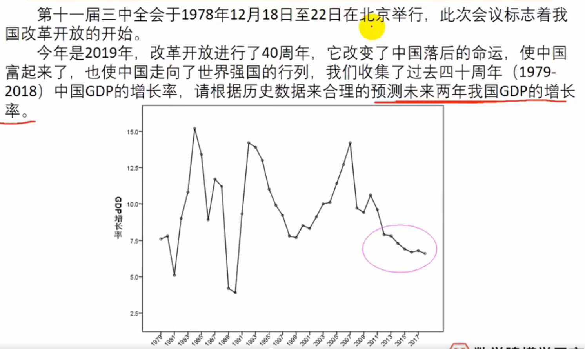
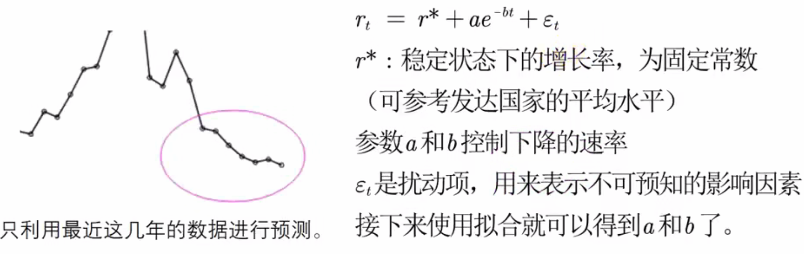

*伴随预测模型的学习，不断完善。*

## 预测综述
#### 预测两要

- 一结合背景。

- 二合理解释。

#### 预测两不要。

- 不要硬套模型。

- 不要不做解释。

---
    例子：
    套用一个不错的模型，误差足够小（便使用）？
    考虑插值算法，SSE=0，但并不是一个好的预测模型，且缺乏明确表达式。

### 例子

    
拟合算法提供可解释的表达式。
        
        
