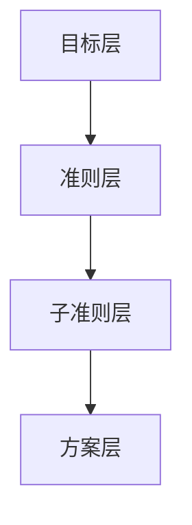

# 层次分析法

## 基本概念

决策分析是指对多种方案进行比较、判断和评价的过程。这类问题具有以下特点：

1. **主观性**  
   评价标准往往包含个人主观因素
2. **权重差异**  
   不同决策者对各因素的重视程度不同
3. **数学建模挑战**  
   主观因素导致传统数学方法难以直接应用

> 层次分析法(AHP)正是为解决这类主观决策问题而发展的系统化方法。

## 层次分析法原理

### 一、层次结构模型
将复杂决策问题分解为三个层次：

1. **目标层**（最高层）  
   决策的最终目的（唯一元素）

2. **准则层**（中间层）  
   实现目标涉及的评估准则（可多级细分）

3. **方案层**（最底层）  
   可供选择的具体方案

### 二、实施步骤
1. **构建层次模型**  
   明确目标→准则→方案的支配关系

2. **构造判断矩阵**  
   对同一层次元素进行两两重要性比较

- 对同层次指标进行重要性两两比较
- 比较结果构成正互反矩阵

3. **一致性检验**  
   验证判断逻辑的合理性（CR < 0.1）

### 一致矩阵的条件
1. **传递性关系**  
   ```math
   a_{ij} = a_{ik} \times a_{kj}
   ```
2. **行（列）成比例**  
   矩阵各行或列之间呈倍数关系

### 矩阵类型定义
| 矩阵类型 | 条件 | 示例 |
|----------|------|------|
| **正互反矩阵** | `a_{ij} > 0` 且 `a_{ij} × a_{ji} = 1` | 所有AHP判断矩阵 |
| **一致矩阵** | 满足正互反矩阵条件+传递性关系 | 如下示例 |

#### 一致矩阵示例
```math
\begin{bmatrix}
1 & 2 & 4 \\
\frac{1}{2} & 1 & 2 \\
\frac{1}{4} & \frac{1}{2} & 1
\end{bmatrix}
```

### 检验必要性
- 必须通过一致性检验才能用于权重计算
- 检验原理：比较判断矩阵与理想一致矩阵的差异程度


### 计算一致性指标CI
```math
CI = \frac{\lambda_{max} - n}{n - 1}
```
其中：
- $\lambda_{max}$：判断矩阵的最大特征值
- $n$：矩阵阶数

### 查询随机一致性指标RI


> 注：当$n>10$时建议建立二级指标体系

### 计算一致性比例CR
```math
CR = \frac{CI}{RI}
```


4. **计算权重**  
   特征根法确定各层元素权重

5. **综合评价**  
   加权计算方案总分



## 权重计算方法

### 算术平均法求权重步骤

1. **列归一化**  
   将判断矩阵每列元素除以其列和：
   ```math
   b_{ij} = \frac{a_{ij}}{\sum_{k=1}^n a_{kj}}
   ```

2. **行求和**  
   对归一化矩阵按行求和：
   ```math
   s_i = \sum_{j=1}^n b_{ij}
   ```

3. **计算权重**  
   将行和除以阶数n：
   ```math
   w_i = \frac{s_i}{n}
   ```


### 几何平均法求权重步骤

1. **行元素相乘**  
   对判断矩阵每行元素求积：
   ```math
   p_i = \prod_{j=1}^n a_{ij} \quad (i=1,2,...,n)
   ```

2. **开n次方**  
   计算几何平均值：
   ```math
   g_i = \sqrt[n]{p_i}
   ```

3. **归一化处理**  
   得到权重向量：
   ```math
   w_i = \frac{g_i}{\sum_{k=1}^n g_k}
   ```

### 特征值法数学原理
对于一致矩阵：
- 最大特征值 $\lambda_{max} = n$（矩阵阶数）
- 其余特征值均为0
- 对应特征向量可直接作为权重向量

### 特征值法求权重步骤
1. **求最大特征值**  
   解特征方程 $|A - \lambda I| = 0$ 得 $\lambda_{max}$

2. **求特征向量**  
   解方程组 $(A - \lambda_{max}I)\mathbf{v} = 0$

3. **归一化处理**  
   ```math
   w_i = \frac{v_i}{\sum_{j=1}^n v_j}
   ```