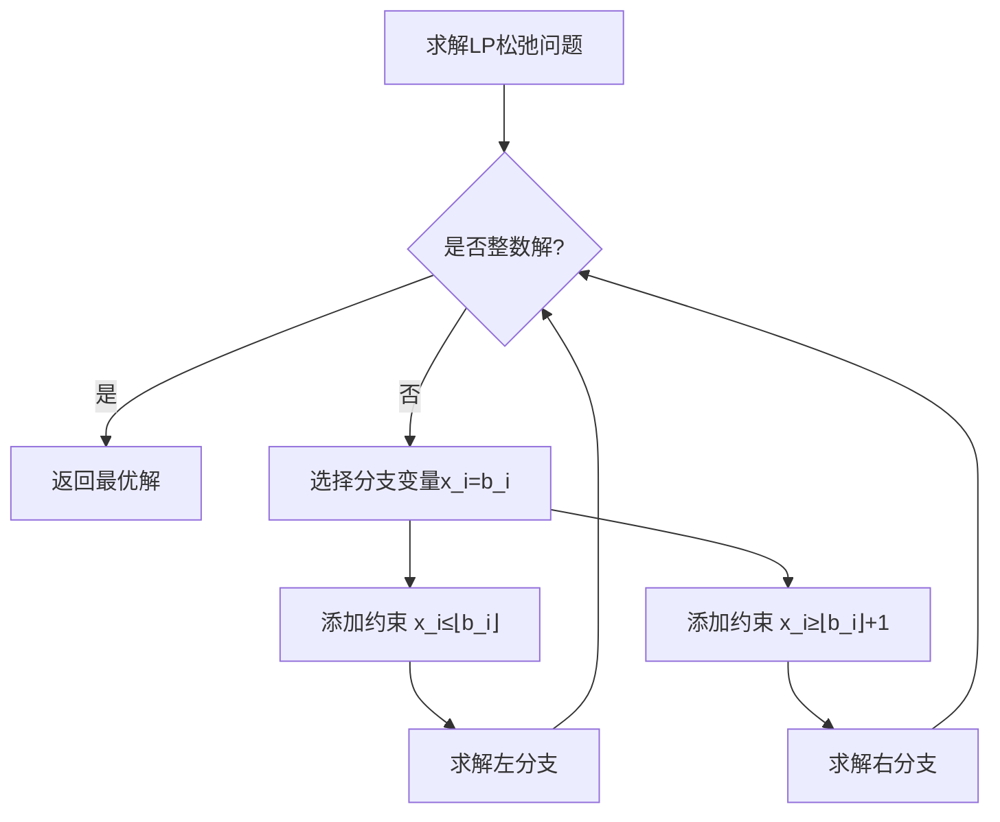

## 整数规划
名字叫整数规划，实际上现有算法只适用于整数线性规划

### 整数规划的特点

当原线性规划存在最优解时，整数规划可能出现三种情况：

第一种情况是原线性规划的最优解本身全为整数，此时整数规划的最优解与线性规划结果完全一致；

第二种情况是引入整数约束后导致问题无可行解；

第三种情况是虽然存在可行解（从而必然存在最优解），但最优解会出现劣化。

特别注意：整数规划的最优解不能通过对线性规划实数最优解简单取整获得。

### 整数规划的一般形式

目标函数：
```math
\max \text{（或} \min\text{）} z = \sum_{j=1}^n c_j x_j\\
```

约束条件：
```math
\begin{aligned}
&\sum_{j=1}^n a_{ij} x_j \leq \text{（或} =,\, \geq\text{）} b_i, &i=1,2,\ldots,m \\
&x_j \geq 0 \text{ 且为整数}, &j=1,2,\ldots,n
\end{aligned}
```

### 1. 纯整数规划 (Pure Integer Programming)
- **决策变量**：所有 $x_j$ 必须取非负整数值  
  $$x_j \in \mathbb{Z}^+ \quad \forall j$$
- **特殊说明**：引入的松弛变量/剩余变量可不要求整数

### 2. 全整数规划 (All Integer Programming)
- **决策变量**：所有 $x_j$ 必须取非负整数值  
  $$x_j \in \mathbb{Z}^+ \quad \forall j$$
- **系数要求**：约束系数 $a_{ij}$ 和常数项 $b_i$ 必须为整数  
  $$a_{ij}, b_i \in \mathbb{Z}$$
- **特殊说明**：松弛变量/剩余变量也必须为整数

### 3. 混合整数规划 (Mixed Integer Programming, MIP)
- **决策变量**：部分变量为整数，部分为实数
- 
  $$
  \begin{cases}
  x_k \in \mathbb{Z}^+ & k \in I \\
  x_l \in \mathbb{R}^+ & l \notin I
  \end{cases}
  $$
  
  （其中 $I$ 为整数变量下标集合）

### 4. 0-1整数规划 (Binary Integer Programming)
- **决策变量**：所有变量仅能取 0 或 1  
  $$x_j \in \{0,1\} \quad \forall j$$


#### 解释：
松弛变量&剩余变量：将不等式约束转换为等式约束的变量，如：

```math
\begin{aligned}
\text{原约束} &: \sum_{j=1}^n a_{ij}x_j \leq b_i \\
\text{引入松弛变量 } s_i \geq 0 &: \sum_{j=1}^n a_{ij}x_j + s_i = b_i
\end{aligned}
```

```math
\begin{aligned}
\text{原约束} &: \sum_{j=1}^n a_{ij}x_j \geq b_i \\
\text{引入剩余变量 } s_i \geq 0 &: \sum_{j=1}^n a_{ij}x_j - s_i = b_i
\end{aligned}
```


## 分支定界算法求整数规划



