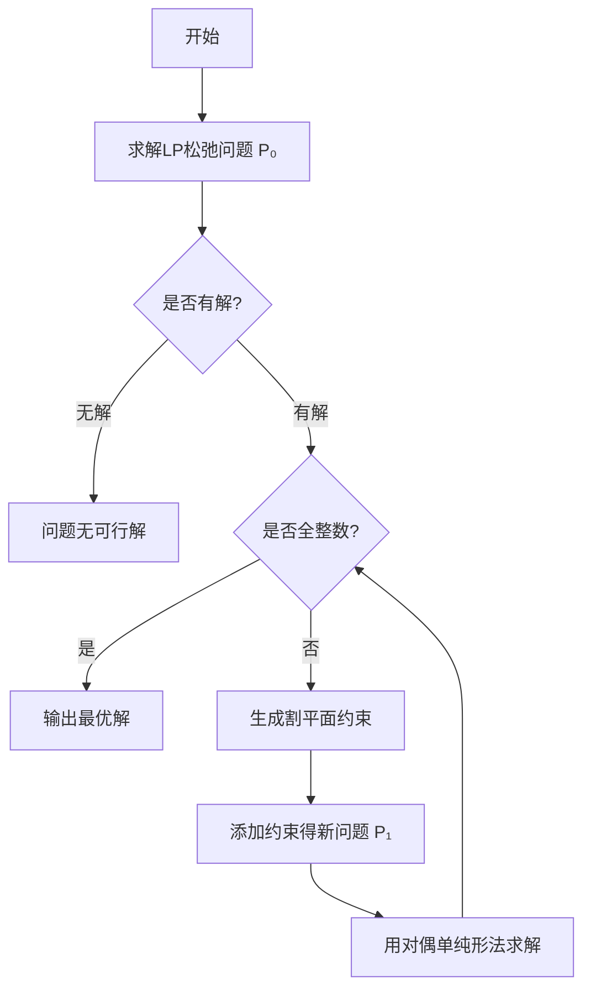

# 割平面法 

## 一、算法步骤

### 1. 整数性检验
- 若松弛问题 $P_0$ 无可行解 → 原问题 $P$ 无解
- 若解 $\mathbf{x}^*$ 全为整数 → 即为最优解
- 若含非整数分量 → 进入切割步骤

### 2. 生成割平面
对非整数基变量 $x_j$ 对应的约束方程：
```math
x_j + \sum_{k \in N} a_{jk}x_k = b_j
```
进行系数拆分：
```math
\begin{cases} 
a_{jk} = \lfloor a_{jk} \rfloor + f_{jk} \\ 
b_j = \lfloor b_j \rfloor + f_j 
\end{cases} \quad (0 \leq f_{jk}, f_j < 1)
```
得到Gomory割平面：
```math
\sum_{k \in N} f_{jk}x_k \geq f_j
```

### 3. 迭代求解
将割平面加入 $P_0$ 形成 $P_1$，用**对偶单纯形法**求解，重复直到获得整数解

## 二、算法流程图


## 三、关键说明
| 符号 | 含义 |
|------|------|
| $P$ | 原整数规划问题 |
| $P₀$ | 线性松弛问题 |
| $f_{jk}$ | 系数的小数部分 |
| $N$ | 非基变量索引集 |

> **注意**：实际实现时需要处理数值精度问题，建议设置误差容限 $\epsilon = 10^{-6}$ 来判断整数性。
